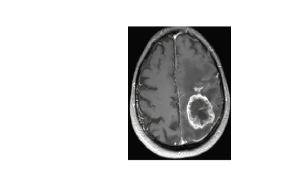

# Brain-Tumour-Segmentations
*Detection of Brain Tumour using the given MRI Image*

## Indroduction 

 The Brain Tumor is affecting many people worldwide. It is not only limited with the old age people but also detected in the early age. Brain Tumor is the abnormal growth of cell inside the brain cranium which limits the functioning of the brain. Early detection of the brain tumor is possible with the advancement of machine learning (ML) and image processing (IP) .In this paper stages of image processing are discussed and overview of the analogous papers are quoted by analyzing several research papers. This paper provides gist of technologies which can be used to predict brain tumor.
 This project is using Image processing techniques like 
 >1.Converting Image into gray scale
 
 >2.Median Filtering
 
 >3.Edge Detection
 
 >4.Thresholding
 
 >5.Watershed Algorithm
 
 ## Step Wise Processing
 
 ### Real Image
 
 
 ### Importing Required Libraries

### Reading Image

 
 ### Converting to Greyscale
 
 

## Output

  

